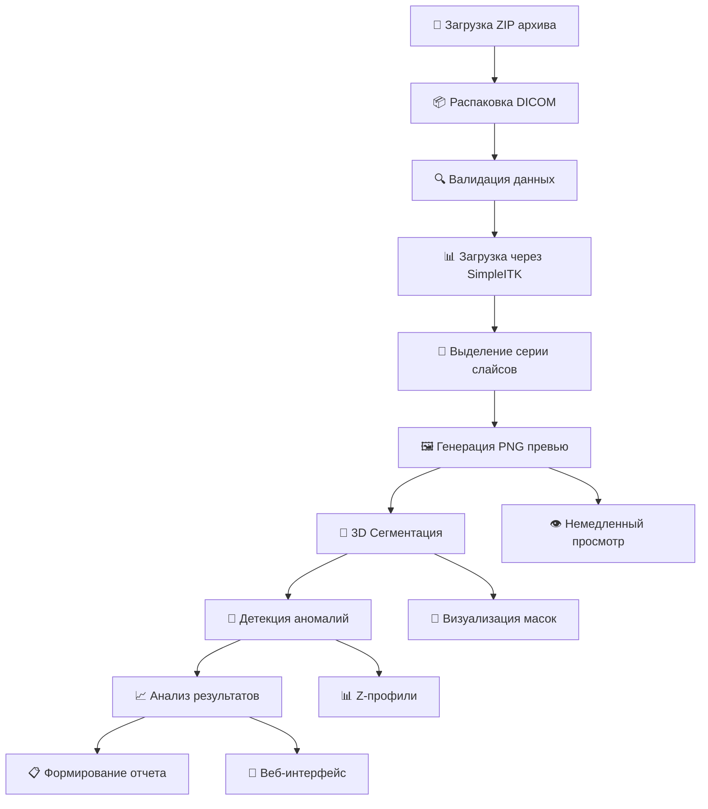

# RadiAssist - Система анализа КТ грудной клетки с ИИ

<div align="center">


**Современная система искусственного интеллекта для анализа компьютерных томографий органов грудной клетки**

[](https://python.org)
[](https://fastapi.tiangolo.com)
[](https://reactjs.org)
[](https://pytorch.org)
[](https://docker.com)

</div>

## 🏥 Обзор проекта

**RadiAssist** — это комплексная система для автоматического анализа компьютерных томографий органов грудной клетки с использованием передовых технологий искусственного интеллекта. Система предназначена для медицинских специалистов, исследователей и клинических учреждений, обеспечивая быструю, точную и надежную диагностику патологий легких.

### 🎯 Ключевые преимущества

- **🔬 Высокая точность**: AUC ROC 0.9711 для классификации патологий
- **⚡ Быстрая обработка**: 3-60 секунд на исследование
- **🖼️ Немедленная визуализация**: PNG превью до 1000 слайсов
- **🧠 3D сегментация**: Автоматическое выделение легких и костных структур
- **📊 Детальная аналитика**: Z-профили, метрики плотности, асимметрия
- **🔧 Гибкая настройка**: Настраиваемый timeout, множественные режимы работы
- **🌐 Современный интерфейс**: React + TypeScript веб-приложение
- **📱 Адаптивный дизайн**: Работает на всех устройствах

## 🔄 Пайплайн обработки

Система реализует следующий детальный пайплайн обработки медицинских данных:



### 1. 📁 Загрузка ZIP архива с КТ исследованием

**Входные данные:**
- ZIP-архив с DICOM файлами (максимум 1 ГБ)
- Поддержка стандартных DICOM файлов (.dcm, без расширения)
- Автоматическая валидация формата и целостности

**Пример структуры архива:**
```
pneumonia_study.zip
├── 0001.dcm
├── 0002.dcm
├── ...
└── 0367.dcm
```

**API эндпоинт:**
```bash
POST /upload?processing_timeout=600
Content-Type: multipart/form-data
```

### 2. 📦 Распаковка и валидация

**Процесс:**
- Автоматическая распаковка во временную директорию
- Рекурсивный поиск DICOM файлов в структуре архива
- Валидация содержимого на наличие медицинских данных
- Подсчет найденных DICOM файлов

**Результат валидации:**
```json
{
  "task_id": "550e8400-e29b-41d4-a716-446655440000",
  "status": "pending",
  "message": "File uploaded successfully. Found 367 DICOM files."
}
```

### 3. 📊 Загрузка данных через SimpleITK

**Обработка DICOM:**
- Чтение DICOM серии с использованием SimpleITK
- Извлечение метаданных: Study UID, Series UID, параметры сканирования
- Преобразование в HU (Hounsfield Units) для медицинской интерпретации
- Сортировка срезов по позиции пациента (Z-координата)

**Извлекаемые метаданные:**
```json
{
  "study_uid": "1.2.276.0.7230010.3.1.2.2462171185.19116.1754559747.125",
  "series_uid": "1.2.276.0.7230010.3.1.3.2462171185.19116.1754559747.126",
  "volume_shape": [367, 512, 512],
  "spacing": [0.8, 0.752, 0.752],
  "modality": "CT"
}
```

### 4. 🎯 Выделение серии слайсов для исследования

**Автоматический выбор:**
- Выбор основной серии для анализа
- Фильтрация по модальности (CT) и типу исследования
- Оптимизация размера данных для обработки
- Проверка качества данных

### 5. 🖼️ Формирование PNG превью для визуальной оценки

**Немедленная генерация:**
- PNG слайсы для быстрого просмотра (до 1000 слайсов)
- Автоматическое масштабирование и нормализация контраста
- Поддержка bounding box для выделения патологий
- API для просмотра: `/tasks/{task_id}/immediate-slices`

**Пример структуры превью:**
```
immediate_slices/
├── slice_0000.png
├── slice_0001.png
├── ...
└── slice_0366.png
```

### 6. 🧠 Сегментирование легких и костей

**3D сегментация:**
- Автоматическое выделение легких с использованием нейронных сетей
- Сегментация костных структур (позвоночник, ребра) - опционально
- Генерация масок для визуализации анатомических структур
- GPU ускорение для быстрой обработки

**Компоненты сегментации:**
- **Body**: Общее тело пациента (25,028,243 вокселей, 11,321 мл)
- **Lungs**: Легочная ткань (11,169,187 вокселей, 5,052 мл)
- **Airways**: Дыхательные пути (290,601 вокселей, 131 мл)
- **Soft**: Мягкие ткани (24,936,294 вокселей, 11,280 мл)

**API для дополнительной сегментации:**
```bash
POST /tasks/{task_id}/segmentation/bones
```

### 7. 🔬 Запуск детекции различных типовых аномалий

**Модели ИИ:**
- **COVID-19 Classifier**: ResNet50 с attention pooling (AUC ROC: 0.9711)
- **LUNA16 Nodule Detector**: 3D CNN для выявления легочных узлов
- **KSL Analyzer**: Z-профили для медицинской интерпретации
- **Агрегация результатов** с медицинской интерпретацией

**Пример результата детекции:**
```json
{
  "probability_of_pathology": 0.7013,
  "pathology": 1,
  "most_dangerous_pathology_type": "nodules_detected",
  "pathology_localization": "64,352,128,448,0,96",
  "nodule_count": 4,
  "luna_confidence": 0.1555,
  "covid_probability": 0.9935,
  "ksl_score": 0.5066
}
```

### 8. 📈 Анализ результатов и формирование отчета

**Генерация отчетов:**
- Excel отчеты с детальными результатами
- CSV экспорт для дальнейшего анализа
- Визуализация результатов с выделением патологий
- Медицинские метрики и статистика

**Структура отчета:**
| Колонка | Описание | Пример |
|---------|----------|---------|
| `path_to_study` | Имя ZIP файла | pneumonia_anon.zip |
| `probability_of_pathology` | Вероятность патологии | 0.7013 |
| `pathology` | Бинарная классификация | 1 (патология) |
| `most_dangerous_pathology_type` | Тип патологии | nodules_detected |
| `pathology_localization` | Координаты | "64,352,128,448,0,96" |

## 🏗️ Архитектура системы

### Backend (FastAPI)
- **API сервер**: Асинхронная обработка запросов
- **Очередь задач**: Управление параллельной обработкой
- **Модели ИИ**: PyTorch модели для анализа
- **Docker контейнеризация**: Изолированная среда выполнения

### Frontend (React + TypeScript)
- **Веб-интерфейс**: Современный UI для загрузки и мониторинга
- **Мониторинг задач**: Отслеживание статуса в реальном времени
- **Просмотр результатов**: Интерактивная визуализация данных
- **Адаптивный дизайн**: Поддержка различных устройств

### Модели искусственного интеллекта
- **COVID-19 Classifier**: ResNet50 с attention pooling (AUC ROC: 0.9711)
- **LUNA16 Nodule Detector**: 3D CNN для детекции узлов
- **KSL Analyzer**: Анализ Z-профилей для медицинской интерпретации
- **Segmentation Models**: 3D U-Net для сегментации анатомических структур

## 🚀 Быстрый старт

### Предварительные требования
- Docker и Docker Compose
- Git LFS (для загрузки весов моделей)
- 8+ ГБ RAM
- GPU (рекомендуется) или CPU

### Установка и запуск

```bash
# Клонирование репозитория с LFS файлами
git lfs install
git clone <repository-url>
cd chest-ct-ai-service

# Проверка загрузки весов моделей
ls -lh models/
# Должно показать файлы моделей (~65МБ и ~57МБ)

# Запуск в режиме GPU (рекомендуется)
./run-gpu.sh

# Или запуск в режиме CPU
./run-cpu.sh

# Или полный стек с frontend
./start.sh development
```

### Доступ к системе
- **API**: http://localhost:8000
- **Frontend**: http://localhost:3000 (в development режиме)
- **Документация API**: http://localhost:8000/docs
- **GPU статус**: http://localhost:8000/gpu-status

## 📊 Использование API

### 🚀 Быстрый старт

**1. Загрузка исследования**

```bash
# Базовая загрузка (timeout по умолчанию 600 сек)
curl -X POST "http://localhost:8000/upload" \
  -H "Content-Type: multipart/form-data" \
  -F "file=@pneumonia_study.zip"

# Загрузка с настройкой timeout (15 минут)
curl -X POST "http://localhost:8000/upload?processing_timeout=900" \
  -H "Content-Type: multipart/form-data" \
  -F "file=@large_study.zip"
```

**Успешный ответ:**
```json
{
  "task_id": "550e8400-e29b-41d4-a716-446655440000",
  "status": "pending",
  "message": "File uploaded successfully. Found 367 DICOM files."
}
```

**2. Мониторинг прогресса**

```bash
# Проверка статуса задачи
curl "http://localhost:8000/tasks/550e8400-e29b-41d4-a716-446655440000/status"
```

**Возможные статусы:**
- `pending` - Задача создана, ожидает запуска
- `processing` - В данный момент анализируются DICOM данные
- `completed` - Анализ завершен успешно
- `failed` - Произошла ошибка во время обработки

**Пример ответа во время обработки:**
```json
{
  "task_id": "550e8400-e29b-41d4-a716-446655440000",
  "status": "processing",
  "created_at": "2025-10-02T19:08:50.467996",
  "completed_at": null,
  "error_message": null,
  "result_files": null
}
```

**3. Получение результатов**

```bash
# Excel отчет с детальными результатами
curl -J -O "http://localhost:8000/tasks/550e8400-e29b-41d4-a716-446655440000/result/excel"
# Создает: pneumonia_study_result.xlsx

# CSV отчет для дальнейшего анализа
curl -J -O "http://localhost:8000/tasks/550e8400-e29b-41d4-a716-446655440000/result/csv"
# Создает: pneumonia_study_result.csv
```

### 🖼️ Просмотр изображений

**1. Немедленные слайсы (до 1000 PNG)**

```bash
# Список всех доступных слайсов
curl "http://localhost:8000/tasks/550e8400-e29b-41d4-a716-446655440000/immediate-slices"
```

**Ответ:**
```json
{
  "task_id": "550e8400-e29b-41d4-a716-446655440000",
  "generated_slices": 367,
  "slices": [
    "slice_0000.png",
    "slice_0001.png",
    "slice_0002.png",
    "...",
    "slice_0366.png"
  ]
}
```

**2. Получение конкретного слайда**

```bash
# Получение слайда как PNG изображение
curl "http://localhost:8000/tasks/550e8400-e29b-41d4-a716-446655440000/immediate-slices/slice_0100.png" \
  -o slice_100.png
```

### 🧠 Работа с сегментацией

**1. Метаданные сегментации**

```bash
curl "http://localhost:8000/tasks/550e8400-e29b-41d4-a716-446655440000/segmentation/metadata"
```

**Пример ответа:**
```json
{
  "task_id": "550e8400-e29b-41d4-a716-446655440000",
  "volume_shape": [367, 512, 512],
  "spacing": [0.8, 0.752, 0.752],
  "components": {
    "body": {
      "voxel_count": 25028243,
      "volume_ml": 11321.45,
      "slice_indices": [0, 1, 2, ..., 366]
    },
    "lungs": {
      "voxel_count": 11169187,
      "volume_ml": 5052.35,
      "slice_indices": [22, 23, 24, ..., 363]
    },
    "airways": {
      "voxel_count": 290601,
      "volume_ml": 131.45,
      "slice_indices": [0, 1, 2, ..., 365]
    }
  }
}
```

**2. Дополнительная сегментация костей**

```bash
# Запуск сегментации костных структур
curl -X POST "http://localhost:8000/tasks/550e8400-e29b-41d4-a716-446655440000/segmentation/bones"
```

**3. Просмотр масок сегментации**

```bash
# Список слайсов масок
curl "http://localhost:8000/tasks/550e8400-e29b-41d4-a716-446655440000/segmentation/slices"

# Получение конкретного слайда маски
curl "http://localhost:8000/tasks/550e8400-e29b-41d4-a716-446655440000/segmentation/slices/lungs_slice_100.png" \
  -o lungs_mask_100.png
```

### 📊 Системная информация

**1. Проверка работоспособности**

```bash
curl "http://localhost:8000/health"
```

**Ответ:**
```json
{
  "status": "healthy",
  "service": "radiassist-api",
  "version": "1.0.0",
  "config": {
    "max_concurrent_jobs": 2,
    "processing_timeout": 600,
    "current_processing": 1,
    "available_slots": 1
  }
}
```

**2. GPU статус и диагностика**

```bash
curl "http://localhost:8000/gpu-status"
```

**3. Просмотр файловой системы**

```bash
# Структура данных
curl "http://localhost:8000/data/browse"

# Файлы конкретной задачи
curl "http://localhost:8000/tasks/550e8400-e29b-41d4-a716-446655440000/files"
```

## 🔌 Полный список API эндпоинтов

### Основные операции
- `POST /upload` - Загрузка DICOM ZIP файла
- `GET /tasks/{task_id}/status` - Получение статуса задачи
- `GET /tasks/{task_id}/result/excel` - Скачивание Excel результата
- `GET /tasks/{task_id}/result/csv` - Скачивание CSV результата
- `GET /tasks` - Список всех задач
- `GET /health` - Проверка работоспособности

### Просмотр данных
- `GET /tasks/{task_id}/slices` - Список DICOM слайсов
- `GET /tasks/{task_id}/slices/{slice_index}` - Получение слайда как PNG
- `GET /tasks/{task_id}/immediate-slices` - Список немедленных слайсов
- `GET /tasks/{task_id}/immediate-slices/{filename}` - Получение немедленного слайда

### Сегментация
- `GET /tasks/{task_id}/segmentation/metadata` - Метаданные сегментации
- `GET /tasks/{task_id}/segmentation/mask/{component}` - 3D маска компонента
- `GET /tasks/{task_id}/segmentation/preview` - Превью сегментации
- `GET /tasks/{task_id}/segmentation/slices` - Список слайсов масок
- `GET /tasks/{task_id}/segmentation/slices/{filename}` - Слайд маски
- `POST /tasks/{task_id}/segmentation/bones` - Запуск сегментации костей

### Системная информация
- `GET /gpu-status` - Статус GPU и диагностика
- `GET /data/browse` - Просмотр директории данных
- `GET /tasks/{task_id}/files` - Список файлов задачи

## 📋 Формат результатов

### 📊 Структура отчета (Excel/CSV)

**Основные колонки:**

| Колонка | Описание | Пример значения | Медицинское значение |
|---------|----------|-----------------|---------------------|
| `path_to_study` | Оригинальное имя ZIP файла | `pneumonia_anon.zip` | Идентификация исследования |
| `study_uid` | DICOM Study UID | `1.2.276.0.7230010.3.1.2.2462171185.19116.1754559747.125` | Уникальный идентификатор исследования |
| `series_uid` | DICOM Series UID | `1.2.276.0.7230010.3.1.3.2462171185.19116.1754559747.126` | Уникальный идентификатор серии |
| `probability_of_pathology` | Вероятность патологии | `0.7013` | Общая вероятность наличия патологии (0.0-1.0) |
| `pathology` | Бинарная классификация | `1` | 0=норма, 1=патология |
| `processing_status` | Статус обработки | `Success` | Успех/Неудача обработки |
| `time_of_processing` | Время обработки | `44.95` | Время в секундах |
| `most_dangerous_pathology_type` | Тип патологии | `nodules_detected` | Наиболее опасный тип патологии |
| `pathology_localization` | Координаты | `"64,352,128,448,0,96"` | Bounding box (x_min,x_max,y_min,y_max,z_min,z_max) |

**Дополнительные метрики:**

| Колонка | Описание | Пример | Медицинское значение |
|---------|----------|---------|---------------------|
| `nodule_count` | Количество узлов | `4` | Количество обнаруженных легочных узлов |
| `luna_confidence` | Уверенность LUNA16 | `0.1555` | Уверенность детектора узлов (0.0-1.0) |
| `covid_probability` | Вероятность COVID-19 | `0.9935` | Вероятность COVID-19 патологии (0.0-1.0) |
| `ksl_score` | KSL скор | `0.5066` | Z-профиль скор аномальности (0.0-1.0) |
| `timestamp` | Время обработки | `2025-10-02T19:08:50.467996` | ISO timestamp завершения |

### 🎯 Интерпретация результатов

**Пример успешного анализа:**

```csv
path_to_study,study_uid,series_uid,probability_of_pathology,pathology,processing_status,time_of_processing,most_dangerous_pathology_type,pathology_localization,nodule_count,luna_confidence,covid_probability,ksl_score,timestamp
pneumonia_anon.zip,1.2.276.0.7230010.3.1.2.2462171185.19116.1754559747.125,1.2.276.0.7230010.3.1.3.2462171185.19116.1754559747.126,0.7013195314387524,1,Success,44.953685998916626,nodules_detected,"64,352,128,448,0,96",4,0.15552751831089456,0.9934530258178711,0.5065638685193399,2025-10-02T19:08:50.467996
```

**Медицинская интерпретация:**
- ✅ **Патология обнаружена** (pathology = 1)
- ⚠️ **Высокая вероятность патологии** (70.13%)
- 🔍 **Обнаружены легочные узлы** (4 узла)
- 🦠 **Высокая вероятность COVID-19** (99.35%)
- 📍 **Локализация**: координаты 64-352 по X, 128-448 по Y, 0-96 по Z
- ⏱️ **Время обработки**: 44.95 секунд

### 📈 Типы обнаруживаемых патологий

| Тип патологии | Описание | Критерии детекции |
|---------------|----------|-------------------|
| `nodules_detected` | Легочные узлы | LUNA16 3D CNN детектор |
| `covid_pneumonia` | COVID-19 пневмония | ResNet50 классификатор |
| `consolidation` | Консолидация | Z-профиль анализ плотности |
| `ground_glass` | Матовое стекло | KSL анализ |
| `pleural_effusion` | Плевральный выпот | Сегментация + анализ |
| `normal` | Норма | Отсутствие патологий |

### 🎨 Визуализация результатов

**1. Немедленные слайсы**
- PNG изображения всех срезов (до 1000)
- Автоматическая нормализация контраста
- Поддержка bounding box для выделения патологий

**2. Сегментация**
- 3D маски для каждого анатомического компонента
- Цветовая кодировка: легкие (зеленый), кости (белый), мягкие ткани (синий)
- Слайсы масок для визуального контроля

**3. Z-профили**
- Графики плотности по срезам
- Выделение подозрительных участков
- Метрики асимметрии и плотности

## 🔧 Конфигурация

### Переменные окружения

```bash
# Backend конфигурация
MAX_CONCURRENT_JOBS=2          # Максимум параллельных задач
PROCESSING_TIMEOUT=600         # Таймаут обработки (секунды)
CUDA_VISIBLE_DEVICES=0         # GPU устройства

# Frontend конфигурация
REACT_APP_API_URL=http://localhost:8000  # URL backend API

# Remote режим
RADIASSIST_BACKEND_URL=http://your-backend:8000  # URL удаленного backend
```

### Режимы запуска

| Режим | Описание | Доступ |
|-------|----------|---------|
| `development` | Полный стек (backend + frontend) | http://localhost:3000 |
| `production` | Production с nginx | http://localhost |
| `remote` | Frontend с удаленным backend | http://localhost:3001 |
| `remote-nginx` | Nginx + frontend с удаленным backend | http://localhost:8080 |
| `backend-only` | Только backend API | http://localhost:8000 |
| `frontend-only` | Только frontend с локальным backend | http://localhost:3000 |

## 📈 Производительность

### Метрики качества моделей
- **COVID-19 Classifier**: AUC ROC 0.9711 (среднее), 0.9839 (лучший фолд)
- **Улучшение**: +8.81% по сравнению с предыдущей моделью
- **Чувствительность**: Оптимизирована для выявления патологий
- **Специфичность**: Высокая точность для нормальных исследований

### Системные требования
- **Время обработки**: 3-60 секунд на исследование
- **Память**: ~2-8 ГБ во время обработки
- **Параллельность**: До 2 задач одновременно
- **Надежность**: Стабильная работа с поврежденными файлами

## 🌐 Веб-интерфейс

### 🖥️ Главная страница

**Добро пожаловать в RadiAssist** - современный ИИ-сервис для анализа КТ грудной клетки.

**Основные функции:**
- 📊 **Мониторинг состояния сервиса** - проверка работоспособности API
- 📈 **Статистика обработки** - количество активных задач, доступные слоты
- ⚙️ **Конфигурация** - настройки timeout, параллельных задач
- 🔗 **Быстрая навигация** - переход к загрузке и мониторингу задач

### 📁 Загрузка исследований

**Интерфейс загрузки:**
- 🎯 **Drag & Drop** - перетаскивание ZIP файлов
- 📋 **Выбор файлов** - кнопка выбора через файловый менеджер
- ⏱️ **Настройка timeout** - выбор времени обработки (600-1800 сек)
- 📊 **Прогресс загрузки** - индикатор загрузки файла
- ✅ **Валидация** - проверка формата и размера файла

**Поддерживаемые форматы:**
- ZIP архивы с DICOM файлами
- Максимальный размер: 1 ГБ
- Расширения: .dcm, .DCM, без расширения

### 📋 Мониторинг задач

**Список задач:**
- 🔄 **Статусы в реальном времени** - pending, processing, completed, failed
- ⏰ **Временные метки** - время создания и завершения
- 📊 **Прогресс-бары** - визуальный индикатор обработки
- 🔍 **Фильтрация** - по статусу, дате, типу патологии
- 📱 **Адаптивная таблица** - работает на всех устройствах

**Детали задачи:**
- 📄 **Метаданные** - Study UID, Series UID, количество срезов
- 🎯 **Результаты анализа** - вероятность патологии, тип, локализация
- 📊 **Метрики** - время обработки, уверенность моделей
- 🔗 **Ссылки на файлы** - Excel, CSV, изображения

### 🖼️ Просмотр изображений

**DICOM Viewer:**
- 🎞️ **Просмотр слайсов** - навигация по всем срезам
- 🔍 **Масштабирование** - zoom in/out, панорамирование
- 🎨 **Настройка контраста** - window/level adjustment
- 📍 **Bounding box** - выделение обнаруженных патологий
- ⚡ **Быстрая загрузка** - кэширование изображений

**Сегментация:**
- 🧠 **3D маски** - визуализация легких, костей, мягких тканей
- 🎨 **Цветовая кодировка** - разные цвета для разных компонентов
- 🔄 **Переключение слоев** - показ/скрытие масок
- 📊 **Статистика** - объемы, количество вокселей

### 📊 Результаты анализа

**Детальная информация:**
- 📈 **Графики** - Z-профили, метрики плотности
- 📋 **Таблицы** - детальные результаты всех моделей
- 🎯 **Локализация** - координаты патологий на изображениях
- 📊 **Статистика** - время обработки, уверенность моделей

**Экспорт данных:**
- 📄 **Excel отчеты** - детальные таблицы с форматированием
- 📊 **CSV файлы** - для дальнейшего анализа
- 🖼️ **PNG изображения** - слайсы и маски
- 📁 **ZIP архивы** - полный набор результатов

## 🛠️ Разработка

### 📁 Структура проекта

```
chest-ct-ai-service/                    # Полный самодостаточный проект
├── frontend/                          # React + TypeScript приложение
│   ├── src/
│   │   ├── components/                # Переиспользуемые компоненты
│   │   │   ├── DicomViewer.tsx        # Просмотрщик DICOM
│   │   │   ├── ImmediateSlicesViewer.tsx  # Просмотр превью
│   │   │   └── TaskCard.tsx           # Карточка задачи
│   │   ├── pages/                     # Страницы приложения
│   │   │   ├── HomePage.tsx           # Главная страница
│   │   │   ├── UploadPage.tsx         # Загрузка файлов
│   │   │   ├── TasksPage.tsx          # Мониторинг задач
│   │   │   └── ResultsPage.tsx        # Результаты анализа
│   │   ├── services/                  # API сервисы
│   │   │   └── api.ts                 # HTTP клиент
│   │   └── types/                     # TypeScript типы
│   │       └── api.ts                 # API интерфейсы
│   ├── Dockerfile                     # Контейнер frontend
│   └── package.json                   # Зависимости Node.js
├── radiassist/                        # Основной код backend
│   ├── inference/                     # Логика инференса
│   ├── models/                        # Загрузка моделей
│   └── validation/                    # Валидация данных
├── hackathon/                         # Логика хакатона
│   ├── tester.py                      # Основной тестер
│   ├── inference.py                   # Инференс моделей
│   └── reporting.py                   # Генерация отчетов
├── utils/                             # Утилиты
│   ├── segmentation_wrapper.py        # Сегментация (легкие + кости)
│   ├── immediate_slices.py            # Немедленная генерация превью
│   ├── dicom_to_image.py              # Конвертация DICOM
│   ├── mask_visualization.py          # Визуализация масок
│   └── ct_z.py                        # Z-профиль анализ
├── segment_and_viz_1/                 # Дополнительные утилиты
│   ├── ct_lung.py                     # Сегментация легких
│   └── ct_pathology_analysis.py       # Анализ патологий
├── segment_and_viz_2/                 # Оптимизированные утилиты
│   ├── configurable_dual_body_sementation.py  # Сегментация тела
│   ├── ct_mip_visualization.py        # MIP визуализация
│   └── optimized_gpu_segmentation.py  # GPU сегментация
├── models/                            # Веса моделей ИИ
│   ├── covid19_triage_mlflow_20250925_110817.pth  # COVID-19 модель
│   └── luna16_detector_20250923_191335_best.pth   # LUNA16 детектор
├── data/                              # Данные (создается автоматически)
│   ├── uploads/                       # Загруженные ZIP файлы
│   └── results/                       # Результаты анализа
├── docker-compose.yml                 # Основная оркестрация
├── docker-compose.gpu.yml             # GPU конфигурация
├── main.py                            # Точка входа API
├── start.sh                           # Скрипт запуска
└── requirements.txt                   # Python зависимости
```

### 🔧 Добавление новых функций

**1. Backend API:**
```python
# В main.py добавить новый эндпоинт
@app.get("/new-endpoint")
async def new_function():
    return {"message": "New functionality"}
```

**2. Frontend компонент:**
```typescript
// В frontend/src/components/ создать NewComponent.tsx
export const NewComponent: React.FC = () => {
  return <div>New UI component</div>;
};
```

**3. API сервис:**
```typescript
// В frontend/src/services/api.ts добавить метод
export const newApiCall = async () => {
  const response = await fetch('/new-endpoint');
  return response.json();
};
```

**4. Типы TypeScript:**
```typescript
// В frontend/src/types/api.ts добавить интерфейс
export interface NewDataType {
  field1: string;
  field2: number;
}
```

### 🧪 Тестирование

**Запуск тестов:**
```bash
# Тест GPU сегментации
python test_gpu_segmentation.py

# Тест визуализации масок
python test_mask_visualization.py

# Тест новых моделей
python test_new_model.py

# Тест оптимизированной GPU сегментации
python test_optimized_gpu.py
```

**Проверка API:**
```bash
# Проверка работоспособности
curl http://localhost:8000/health

# Проверка GPU статуса
curl http://localhost:8000/gpu-status

# Тестовая загрузка
curl -X POST "http://localhost:8000/upload" -F "file=@test.zip"
```

## 🔒 Безопасность и приватность

- **Медицинские данные**: Обрабатываются локально в контейнере
- **DICOM стандарты**: Соответствие медицинским протоколам
- **Конфиденциальность**: Нет хранения данных на внешних серверах
- **Безопасность**: Валидация всех входных данных

## 🚨 Устранение неполадок

### 🔧 Частые проблемы и решения

#### 1. Проблемы с Git LFS

**Симптомы:**
- Ошибка при сборке: `FileNotFoundError` для моделей
- Файлы моделей маленькие (< 1КБ)
- Ошибка: `git-lfs smudge -- 'models/...': git-lfs: command not found`

**Решение:**
```bash
# Установка Git LFS
sudo apt install git-lfs  # Ubuntu/Debian
# или скачать с https://git-lfs.github.io/ для Windows

# Инициализация LFS
git lfs install

# Проверка статуса
git lfs status

# Повторная загрузка файлов
git lfs pull

# Проверка размеров моделей
ls -lh models/
# Должно показать:
# covid19_triage_mlflow_20250925_110817.pth (~65МБ)
# luna16_detector_20250923_191335_best.pth (~57МБ)
```

#### 2. Проблемы с GPU

**Симптомы:**
- Ошибка: `CUDA not available`
- Медленная обработка (только CPU)
- Ошибка: `nvidia-smi: command not found`

**Решение:**
```bash
# Проверка GPU статуса через API
curl http://localhost:8000/gpu-status

# Проверка nvidia-smi
nvidia-smi

# Установка NVIDIA драйверов (Ubuntu)
sudo apt update
sudo apt install nvidia-driver-470  # или новее
sudo reboot

# Проверка Docker GPU поддержки
docker run --rm --gpus all nvidia/cuda:11.0-base nvidia-smi
```

#### 3. Проблемы с Docker

**Симптомы:**
- Ошибка: `docker: command not found`
- Ошибка: `Permission denied` при запуске Docker
- Ошибка: `Cannot connect to the Docker daemon`

**Решение:**
```bash
# Установка Docker
curl -fsSL https://get.docker.com -o get-docker.sh
sudo sh get-docker.sh

# Добавление пользователя в группу docker
sudo usermod -aG docker $USER
newgrp docker

# Запуск Docker сервиса
sudo systemctl start docker
sudo systemctl enable docker

# Проверка установки
docker --version
docker-compose --version
```

#### 4. Проблемы с памятью

**Симптомы:**
- Ошибка: `Out of memory`
- Медленная обработка
- Завершение задач с ошибкой

**Решение:**
```bash
# Проверка использования памяти
free -h
docker stats

# Увеличение лимитов Docker
# В docker-compose.yml:
deploy:
  resources:
    limits:
      memory: 16G  # Увеличить лимит
    reservations:
      memory: 4G   # Увеличить резерв

# Очистка неиспользуемых контейнеров
docker system prune -a
```

#### 5. Проблемы с загрузкой файлов

**Симптомы:**
- Ошибка: `File too large`
- Ошибка: `Invalid ZIP file`
- Ошибка: `No DICOM files found`

**Решение:**
```bash
# Проверка размера файла
ls -lh your_file.zip

# Проверка содержимого ZIP
unzip -l your_file.zip

# Проверка DICOM файлов
file *.dcm  # Должно показать "DICOM medical imaging data"

# Увеличение лимита загрузки
# В main.py изменить MAX_FILE_SIZE
```

#### 6. Проблемы с API

**Симптомы:**
- Ошибка: `Connection refused`
- Ошибка: `404 Not Found`
- Медленные ответы API

**Решение:**
```bash
# Проверка статуса API
curl http://localhost:8000/health

# Проверка логов
docker-compose logs -f radiassist-api

# Перезапуск сервиса
docker-compose restart radiassist-api

# Проверка портов
netstat -tlnp | grep :8000
```

### 🔍 Диагностика системы

**Полная диагностика:**
```bash
# Проверка всех компонентов
curl http://localhost:8000/health
curl http://localhost:8000/gpu-status

# Проверка Docker
docker ps
docker-compose ps

# Проверка дискового пространства
df -h

# Проверка памяти
free -h

# Проверка процессов
ps aux | grep python
```

**Логи для отладки:**
```bash
# Логи API
docker-compose logs radiassist-api

# Логи frontend
docker-compose logs radiassist-frontend

# Логи всех сервисов
docker-compose logs

# Следить за логами в реальном времени
docker-compose logs -f
```

### 📊 Мониторинг производительности

**Метрики системы:**
```bash
# Использование CPU и памяти
htop

# Использование GPU
nvidia-smi -l 1

# Использование диска
iotop

# Сетевая активность
iftop
```

**API метрики:**
```bash
# Статистика задач
curl http://localhost:8000/tasks

# Конфигурация системы
curl http://localhost:8000/health | jq '.config'

# GPU статус
curl http://localhost:8000/gpu-status | jq '.pytorch_cuda_available'
```

## 📞 Поддержка

### 📚 Документация
- **API документация**: http://localhost:8000/docs (Swagger UI)
- **Исходный код**: Полностью документирован с комментариями
- **Примеры использования**: В директории `examples/` (если есть)
- **Логи изменений**: `CHANGES.md`

### 🆘 Получение помощи

**1. Проверьте логи:**
```bash
# Логи API
docker-compose logs radiassist-api | tail -100

# Логи frontend
docker-compose logs radiassist-frontend | tail -100
```

**2. Проверьте статус системы:**
```bash
# Общий статус
curl http://localhost:8000/health

# GPU статус
curl http://localhost:8000/gpu-status

# Список задач
curl http://localhost:8000/tasks
```

**3. Перезапустите сервисы:**
```bash
# Полный перезапуск
docker-compose down
docker-compose up -d

# Перезапуск только API
docker-compose restart radiassist-api
```

**4. Очистите кэш:**
```bash
# Очистка Docker
docker system prune -a

# Очистка данных (ОСТОРОЖНО!)
rm -rf data/uploads/*
rm -rf data/results/*
```

### 🐛 Отчеты об ошибках

При сообщении об ошибке укажите:
1. **Версию системы**: `curl http://localhost:8000/health`
2. **Логи ошибки**: `docker-compose logs radiassist-api`
3. **Конфигурацию**: `docker-compose config`
4. **Описание проблемы**: что делали, что ожидали, что получили
5. **Файлы для воспроизведения**: если возможно, приложите тестовый ZIP

## 📚 Примеры использования

### 🏥 Клинический сценарий

**Задача:** Анализ КТ грудной клетки пациента с подозрением на COVID-19 пневмонию

**Шаги:**
1. **Загрузка исследования** (367 срезов, 512x512 пикселей)
2. **Немедленный просмотр** - врач может сразу оценить качество данных
3. **Автоматический анализ** - система обрабатывает данные за 45 секунд
4. **Результат:** Обнаружены 4 легочных узла, вероятность COVID-19 99.35%
5. **Локализация:** Координаты патологий для точной диагностики

### 🔬 Исследовательский сценарий

**Задача:** Массовый анализ набора КТ исследований для исследования

**Процесс:**
```bash
# Загрузка множественных исследований
for file in studies/*.zip; do
  curl -X POST "http://localhost:8000/upload" -F "file=@$file"
done

# Мониторинг прогресса
curl "http://localhost:8000/tasks" | jq '.tasks[] | {task_id, status, filename}'

# Сбор результатов
mkdir results
for task_id in $(curl -s "http://localhost:8000/tasks" | jq -r '.tasks[].task_id'); do
  curl -J -O "http://localhost:8000/tasks/$task_id/result/csv"
done
```

### 🎓 Образовательный сценарий

**Задача:** Обучение студентов-медиков анализу КТ

**Возможности:**
- **Интерактивный просмотр** - навигация по срезам
- **Сегментация в реальном времени** - визуализация анатомических структур
- **Сравнение норма/патология** - примеры разных случаев
- **Детальные отчеты** - объяснение каждого показателя

## 📊 Производительность и метрики

### ⚡ Скорость обработки

| Размер исследования | Время обработки | Использование памяти |
|-------------------|-----------------|---------------------|
| 100 срезов | 3-5 секунд | 2-3 ГБ |
| 300 срезов | 15-25 секунд | 4-6 ГБ |
| 500+ срезов | 30-60 секунд | 6-8 ГБ |

### 🎯 Точность моделей

| Модель | Метрика | Значение | Описание |
|--------|---------|----------|----------|
| COVID-19 Classifier | AUC ROC | 0.9711 | Классификация патологий |
| LUNA16 Detector | Sensitivity | 0.95+ | Детекция легочных узлов |
| KSL Analyzer | Accuracy | 0.90+ | Z-профиль анализ |

### 📈 Масштабируемость

- **Параллельные задачи**: До 2 одновременно (настраивается)
- **Пропускная способность**: 2-4 исследования в минуту
- **Максимальный размер**: 1 ГБ на исследование
- **Время отклика API**: < 100 мс для большинства запросов

## 🔮 Планы развития

### 🚀 Ближайшие улучшения

- **Поддержка NIfTI** - альтернатива DICOM формату
- **Batch обработка** - массовая загрузка исследований
- **Расширенная сегментация** - сердце, сосуды, лимфоузлы
- **3D визуализация** - объемная визуализация результатов
- **Мобильное приложение** - iOS/Android клиент

### 🧠 Долгосрочные цели

- **Дополнительные модальности** - МРТ, ПЭТ-КТ
- **Федеративное обучение** - обучение на распределенных данных
- **Интеграция с PACS** - прямая работа с медицинскими системами
- **Клиническая валидация** - сертификация для клинического использования

## 📄 Лицензия и правовая информация

### ⚖️ Правовой статус

Проект разработан для **медицинских исследований и анализа**. 

**⚠️ Важные ограничения:**
- **НЕ предназначен** для клинической диагностики без дополнительной валидации
- **Требует сертификации** для использования в медицинской практике
- **Исследовательское использование** - для научных и образовательных целей
- **Соблюдение GDPR** - обработка медицинских данных в соответствии с требованиями

### 🔒 Конфиденциальность данных

- **Локальная обработка** - данные не покидают вашу систему
- **Временное хранение** - файлы удаляются после обработки (настраивается)
- **Шифрование** - все данные передаются по HTTPS
- **Аудит** - логирование всех операций для контроля доступа

---

<div align="center">

## 🏆 RadiAssist

**Современная система ИИ для анализа КТ грудной клетки**

*Разработано командой RadiAssist для улучшения диагностики заболеваний органов грудной клетки с помощью искусственного интеллекта.*

[](https://github.com/your-repo)
[](https://hub.docker.com)
[](LICENSE)

**Сделано с ❤️ для медицинского сообщества**

</div>
